<!--  

-->

<!-- I am a versatilist and easily adapt to different hats (Full Stack Web Developer 🌐, App Developer 📱, ML Engineer 🤖 or beginner level Designer 🎨) depending on what the project requires. I love exploring new tech stack 💻 and leveraging them to build cool stuffs 🛠️. -->

<!--

### 🧐 More About Me:

- 🔭 &nbsp; I'm currently working on **youtube-audio-player**
- 🤝 &nbsp; I'm looking to collaborate on [sheets-database](https://github.com/rahul-jha98/sheets-database)
- 🌱 &nbsp; I'm currently learning Typescript;
- 👨🏻‍💻 &nbsp; Most of my projects are available on [Github](https://github.com/rahul-jha98?tab=repositories)
- 🎨 &nbsp; Using [this svg](https://storyset.com/illustration/javascript-frameworks/amico) and Figma I made 👉
- 💬 &nbsp; Ask me about anything tech related, I am happy to help;
- 📫 &nbsp; Feel free to ping me on [LinkedIn](https://www.linkedin.com/in/rahul-jha98/)
- 📝 &nbsp; Checkout my [resume](https://drive.google.com/file/d/1ZpR5pVBTnl_Qybq7GE3MGy1SB1JehVSE/view?usp=sharing)
- 📚 &nbsp; When I am free, I read fantasy and fiction novels. Checkout my [Goodreads](https://www.goodreads.com/rahul-jha98) to see the book I have read
-->

<!--### 🛠️ My Projects

-->

# 👋 Hey! I'm Mark!

Welcome to my GitHub profile where I create to amaze with code!

<table>
  <tr>
    <th colspan="2" align="center">
      <h2>🛠️ My Technologies & Tools</h2>
    </th>
    </tr>
    <tr>
    <th align="center">Core Languages</th>
    <th align="center">Mobile</th>
    </tr>
    <tr>
    <td align="center" colspan="1">
      

    </td>
    <td align="center" colspan="1">
      

    </td>
    </tr>
    <tr>
    <th align="center">Frontend & Web</th>
    <th align="center">Backend & Infrastructure</th>
    </tr>
    <tr>
    <td align="center" colspan="1">
      

    </td>
    <td align="center" colspan="1">

</td>
    </tr>

  <tr>
    <th colspan="2" align="left">AI/ML Frameworks & Libraries</th>
    </tr>

<td align="center" colspan="2">

 
 
 
 
 
 
 

</td>

  <tr>
    <th colspan="2" align="left">AI Infrastructure & Data</th>
    </tr>

<td align="center" colspan="2">

</td>

<tr>
<th colspan="2" align="left">AI Services and API</th>
</tr>

<td align="center" colspan="2">

</td>

  </tr>
  <tr> <th colspan="2" align="center">
      <h2> 🏃 My Activity</h2>
    </th></tr>
  <tr>
    <th align="center">📊 My GitHub Metrics</th>
    <th align="center">🈷️ Languages I Use</th>
  </tr>

  <tr>
    <td align="center">
      </img>
    </td>
    <td align="center">
      </img>
    </td>
  </tr>
  <tr>
    <th colspan="2" align="center">
      <h3>🚀 My Coding Journey</h3>
    </th>
  </tr>
  <tr>
    <th>💡 Coding Habits & Activity</th>
    <th>🏆 GitHub Achievements</th>
  </tr>
  <tr>
    <td align="center">
      

My coding patterns and activity

        </img>
      

      
    </td>
    <td align="center">
      

Achievements and milestones

        </img>
      

      
    </td>
  </tr>
  <tr>
    <th>📅 Commit Calendar</th>
    <th>🌟 Stargazers</th>
  </tr>
  <tr>
    <td align="center">
      

My contribution timeline

        </img>
      

      
    </td>
    <td align="center">
      

Stargazers

        </img>
      

      
    </td>
  </tr>
  <tr>
    <th>👨‍💻 Lines of Code</th>
    <th>📌 Habits</th>
  </tr>
  <tr>
    <td align="center">
      

Code contribution statistics

        </img>
      

      
    </td>
    <td align="center">
      

Habits

        </img>
      

      
    </td>
  </tr>
  <tr>
    <th>🎟️ Issues & Pull Requests</th>
    <th>🎫 Following</th>
  </tr>
  <tr>
    <td align="center">
      

My contribution to open source

        </img>
      

      
    </td>
    <td align="center">
      

People I follow and follow me

        </img>
      

      
    </td>
  </tr>
  <tr>
    <th>🎭 Reactions</th>
    <th>📅 Isometric commit calendar</th>
  </tr>
  <tr>
    <td align="center">
      

Reactions

        </img>
      

      
    </td>
    <td align="center">
      

Isometric commit calendar

        </img>
      

      
    </td>
  </tr>
  
  <tr>
    <th colspan="2" align="center">
      <h3>📈 GitHub Stats</h3>
    </th>
  </tr>
  <tr>
    <td align="center">
      
    </td>
    <td align="center">
      
    </td>
  </tr>
  <tr>
    <th colspan="2" align="center">
      <h3>🤝 Let's Connect!</h3>
    </th>
  </tr>
  <tr>
    <td align="center" colspan="2">
      
      
      
      
    </td>
  </tr>
</table>

---

  

  Built with ❤️ using <a href="https://github.com/lowlighter/metrics">GitHub Metrics</a>

